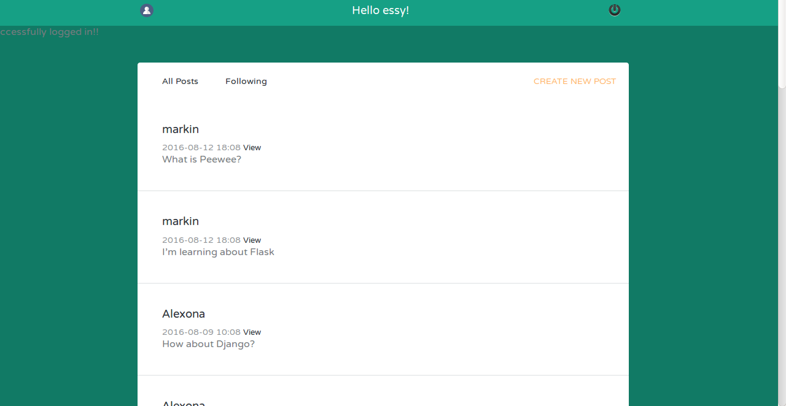
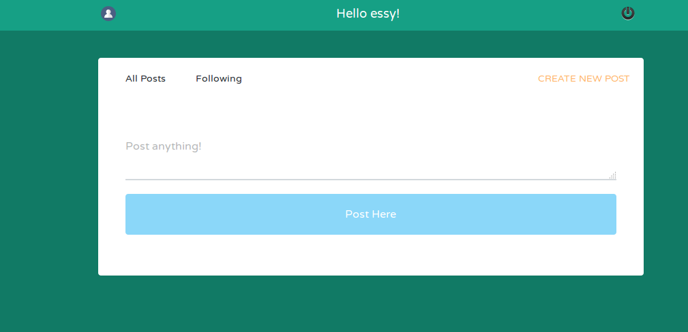
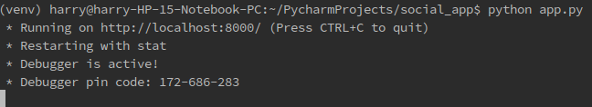

<h1>Social App</h1>

Through the app a new user can be created, existing users followed and removed

<h3>Requirements</h3>
<ol>
    <li><a href="http://flask.pocoo.org/docs/0.11/installation/"/>Virtual environment</a></li>
    <li><a href="http://flask.pocoo.org/"/>Flask</a></li>
    <li><a href="http://flask-sqlalchemy.pocoo.org/2.1/"/>SQLAlchemy</a></li>
    <li><a href="https://packaging.python.org/installing/"/>Python pip</a></li>
</ol>

<h3>Functionalities</h3>
<h3>Register user</h3>

<h3>View all posts</h3>

<h3>Create a new post</h3>

<h3>Running locally</h3>

Install virtualenv

~~~python
sudo pip install virtualenv or sudo easy_install virtualenv

~~~

Create a virtual environment on your project's directory

~~~python
virtualenv venv
~~~

Activate the virtual environment

~~~python
source venv/bin/activate
~~~

Run app.py in the virtual environment

~~~python
python app.py
~~~

Open url on your browser

