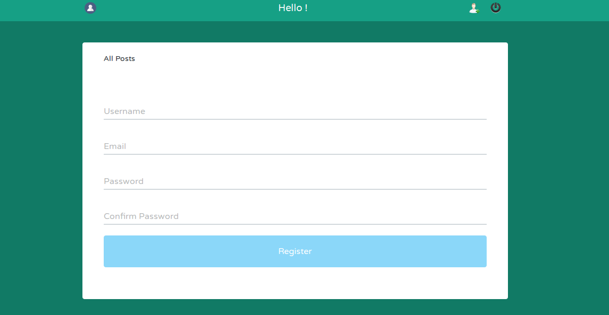

<h1>Social App</h1>

Through the app a new user can be created, existing users followed and removed

<h3>Requirements</h3>
<ol>
    <li><a href="http://flask.pocoo.org/docs/0.11/installation/"/>Virtual environment</a></li>
    <li><a href="http://flask.pocoo.org/"/>Flask</a></li>
    <li><a href="http://flask-sqlalchemy.pocoo.org/2.1/"/>SQLAlchemy</a></li>
    <li><a href="https://packaging.python.org/installing/"/>Python pip</a></li>
</ol>

<h3>Functionalities</h3>
<h3>Register user</h3>

